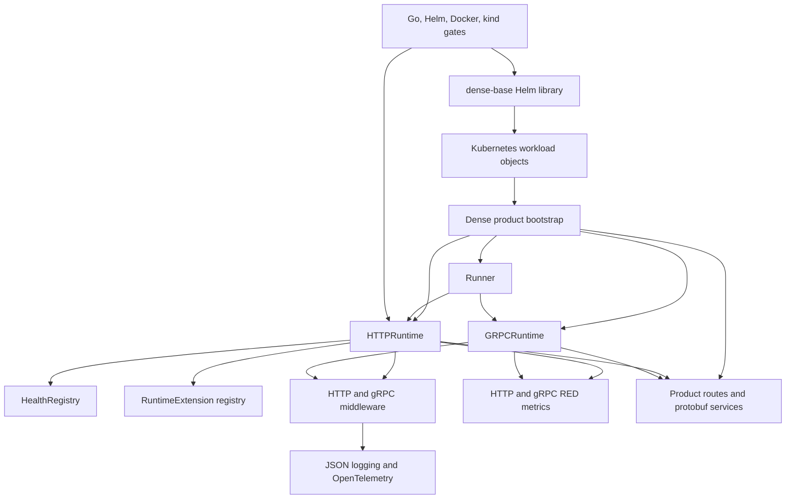
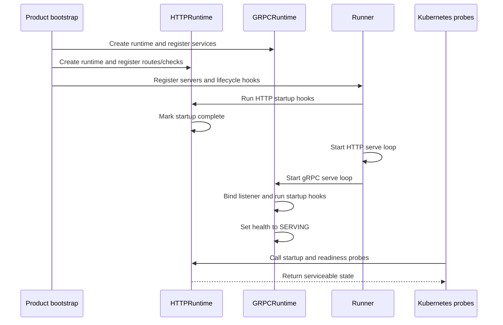
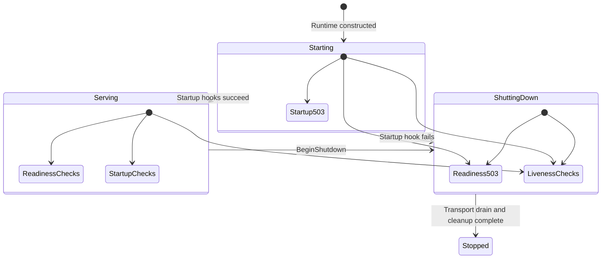
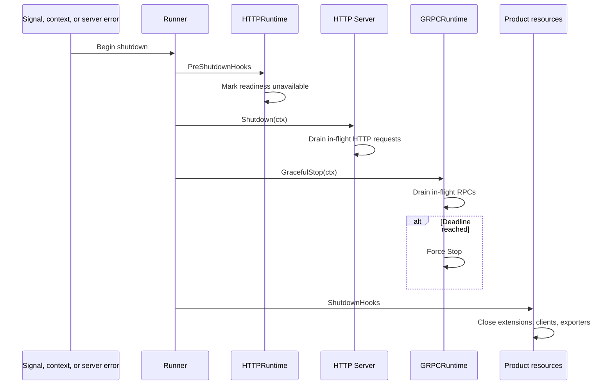
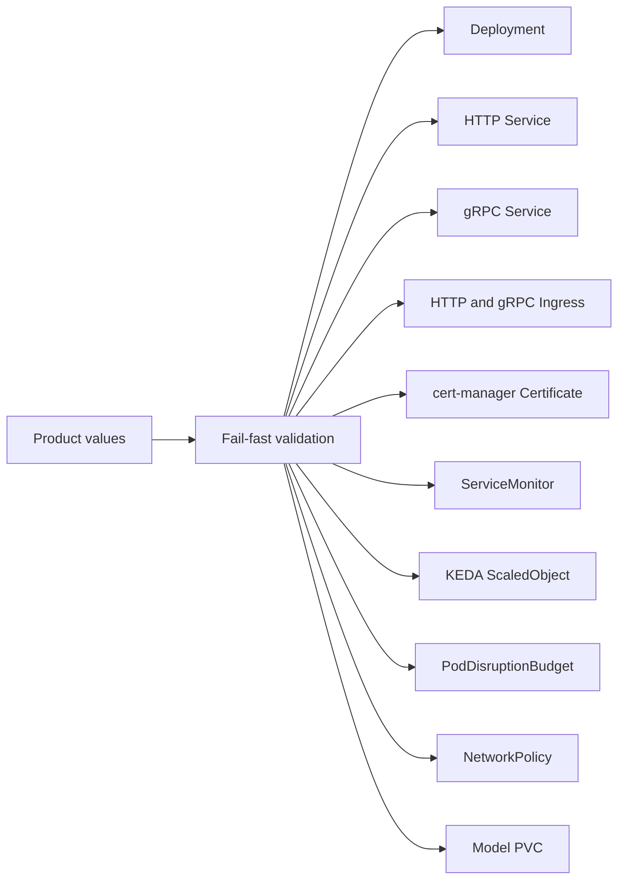

# DenseCloud CTO Architecture Report
## 2026-08-15 implementation baseline

| 항목 | 현재 값 |
| --- | --- |
| Architecture baseline | `bf4eb77` plus the local `v1.1.0` release-candidate hardening |
| Go module | `github.com/DenseAI/DenseCloud` |
| Go version | Go `1.25.13`, toolchain `1.25.13` |
| Helm library chart | `dense-base` `1.1.0` |
| Public release baseline | `v1.0.0`, commit `f1a63ff` |
| Repository maturity | MVP-ready |
| Public distribution stage | `v1.1.0` tag와 OCI chart 발행 대기 |
| Field qualification stage | 실제 Kubernetes controller와 product workload 검증 준비 |

이 문서는 DenseCloud의 코드 구조, 실행 흐름, 상태 전이, 배포 객체,
장애 처리, 검증 범위를 하나의 architecture reference로 정리한다.

---

## 1. Executive Summary

DenseCloud는 Dense Series 제품 서버의 공통 cloud-native serving chassis다.
각 제품은 DenseCloud를 통해 동일한 HTTP/gRPC lifecycle, health contract,
observability, graceful shutdown, Kubernetes packaging, release gate를 사용한다.

현재 구현은 다음 여섯 가지 공통 계약을 제공한다.

1. **HTTP runtime assembly**
   - API router, health endpoint, metrics endpoint, middleware, extension,
     startup/shutdown hook을 하나의 `HTTPRuntime`으로 조립한다.
2. **gRPC runtime assembly**
   - gRPC server, interceptor, health service, RED metrics, listener,
     graceful stop을 하나의 `GRPCRuntime`으로 조립한다.
3. **Lifecycle orchestration**
   - `Runner`가 startup, serving, readiness 차단, HTTP drain, gRPC drain,
     resource cleanup 순서를 관리한다.
4. **Observability baseline**
   - JSON structured logging, request ID, W3C trace propagation, OTLP export,
     HTTP/gRPC RED metrics를 공통 형식으로 제공한다.
5. **Kubernetes deployment contract**
   - Helm library chart가 Deployment, Service, probe, ingress, TLS,
     ServiceMonitor, KEDA, PDB, NetworkPolicy, model volume을 렌더링한다.
6. **Executable release gate**
   - Go test/vet, Helm render matrix, Docker runtime smoke, kind runtime smoke가
     release workflow의 필수 검증 단계로 연결된다.

### 1.1 CTO decision

| Decision area | 판정 | 의미 |
| --- | --- | --- |
| Shared runtime architecture | Ready | HTTP와 gRPC의 공통 조립 경로가 존재한다. |
| Lifecycle safety | Ready | startup rollback과 ordered shutdown이 구현돼 있다. |
| Health and observability | Ready | probe, metrics, logging, tracing contract가 연결돼 있다. |
| Kubernetes packaging | Ready | 주요 운영 객체와 fail-fast validation이 구현돼 있다. |
| Repository-level MVP | Complete | 코드, 테스트, Docker, kind 검증이 통과했다. |
| Public release | Pending | 최신 runtime commit을 포함한 새 tag 발행 단계다. |
| Field qualification | Pending | 실제 controller, CNI, product workload 검증 단계다. |
| Product adoption | Per product | 각 제품 저장소가 chassis entrypoint를 채택하는 단계다. |

### 1.2 Product value

DenseCloud는 제품별 서버 부트스트랩의 중복을 제거한다. 공통 lifecycle이
한 저장소에 모이면서 다음 운영 특성이 제품군 전체에서 동일해진다.

- probe 의미와 상태 코드
- middleware와 interceptor 순서
- request ID, trace ID, log field
- HTTP/gRPC RED metric 이름과 label
- startup failure rollback
- graceful shutdown 순서
- chart security baseline
- release smoke 기준

DenseCore는 inference engine, scheduler, KV cache, model-serving metric을
소유한다. DenseOps는 desired/observed state와 rollout orchestration을
소유한다. DenseEnterprise는 license, quota, attestation, audit enforcement를
소유한다. DenseCloud는 이 제품들이 실행되는 공통 service chassis를
소유한다.

---

## 2. System Context

### 2.1 Architecture boundary

| Layer | DenseCloud가 제공하는 계약 | Consumer가 제공하는 계약 |
| --- | --- | --- |
| HTTP | mux assembly, `/health*`, `/metrics`, middleware preset, lifecycle | domain route, auth policy, CORS policy, body policy, business handler |
| gRPC | server assembly, health service, interceptor preset, metrics, lifecycle | protobuf service, authorization, TLS credential, domain RPC |
| Telemetry | JSON logger, request/trace correlation, RED metrics, OTLP provider | product metric, trace sampling policy, collector endpoint |
| Resilience | timeout context, panic recovery, rate limiter, circuit breaker | workload별 limit, breaker threshold, retry policy |
| Kubernetes | library chart, probe, service, ingress, TLS, KEDA, PDB, NetworkPolicy | image, resource sizing, scheduling, trigger query, model source |
| Release | source/module/chart release workflow, reference runtime smoke | workload image publication, product e2e, production rollout |

### 2.2 Component architecture



### 2.3 Repository layout

| Directory | Architecture role |
| --- | --- |
| `go/server` | HTTP/gRPC runtime, health state, Runner, extension lifecycle |
| `go/middleware` | HTTP middleware, gRPC interceptor, rate limiting, circuit breaker |
| `go/telemetry` | structured logger, Prometheus exposition, OpenTelemetry provider |
| `go/examples` | minimal HTTP, assembled HTTP runtime, combined HTTP/gRPC example |
| `charts/dense-base` | Dense product용 Helm library chart |
| `scripts` | Helm matrix, Docker runtime smoke, kind runtime smoke |
| `.github/workflows` | Go, Docker, Helm, release automation |

### 2.4 Consumer integration invariants

각 product bootstrap은 다음 값을 명시적으로 정렬한다.

| Integration point | Required alignment |
| --- | --- |
| HTTP bind | Chart의 named `http` port와 맞는 `:8080` |
| gRPC bind | Chart 기본 gRPC port를 사용할 때 `:50051` |
| Dual-transport readiness | gRPC/domain startup 상태를 HTTP readiness dependency에 연결 |
| OpenTelemetry | runtime assembly 전에 provider 초기화, shutdown hook에 provider cleanup 연결 |
| TLS | chart가 mount한 certificate path를 gRPC credential loader에 연결 |
| Certificate rotation | reloader annotation과 process reload behavior 연결 |
| Shutdown budget | Runner timeout을 Kubernetes termination grace 안에 배치 |
| KEDA | product metric과 custom trigger query 연결 |

---

## 3. Runtime Construction and Startup

### 3.1 Consumer assembly sequence

Dense product 서버는 다음 순서로 chassis를 조립한다.

1. `telemetry.Init`으로 service name, version, log level을 설정한다.
2. tracing 사용 시 `telemetry.InitOTelTracer`로 OTLP exporter와 sampler를
   초기화한다.
3. gRPC 사용 시 `NewGRPCRuntime`을 생성하고 protobuf service를 등록한다.
4. `NewHTTPRuntime`을 생성하고 gRPC metrics collector를 HTTP `/metrics`에
   연결한다.
5. product API route와 health dependency를 등록한다.
6. 표준 `http.Server`에 `HTTPRuntime.Handler()`를 연결한다.
7. `Runner`에 HTTP server, optional gRPC runtime, startup hook,
   pre-shutdown hook, shutdown hook을 등록한다.
8. `Runner.RunBlocking`이 signal, context, server error를 관리한다.

### 3.2 Startup sequence



### 3.3 Cross-transport readiness

HTTP와 gRPC는 독립적인 health plane을 제공한다. Kubernetes chart의 probe는
HTTP `/health/ready`를 조회하고, gRPC client는 standard gRPC health service를
조회한다.

`Runner`는 HTTP startup hook을 실행한 뒤 HTTP와 gRPC serve loop를
시작한다. `GRPCRuntime`의 startup hook과 `SERVING` 전이는 gRPC serve loop
안에서 실행된다. Dual-transport product는 다음 조립 방식으로 pod readiness를
통합한다.

1. 두 transport가 공유하는 dependency 초기화를 Runner startup hook에
   배치한다.
2. gRPC/domain serving 상태를 `HTTPRuntime.Health()` readiness check로
   등록한다.
3. HTTP readiness check가 composite serving state를 반환한다.
4. Kubernetes Service는 두 transport가 준비된 시점에 pod traffic을 연다.

이 contract는 gRPC service registration, model loading, worker startup을
HTTP readiness와 하나의 pod 상태로 결합한다.

### 3.4 Startup error behavior

| Failure point | Runtime behavior | Resource behavior |
| --- | --- | --- |
| HTTP runtime construction | configuration error 반환 | server 시작 전 종료 |
| HTTP startup hook | startup error 반환 | HTTP shutdown hooks를 한 번 실행 |
| gRPC listener bind | bind error 반환 | serve loop 종료 |
| gRPC startup hook | startup error 반환 | listener close, health shutdown, cleanup hook 실행 |
| Runner startup hook | startup error 반환 | 전체 Runner shutdown sequence 실행 |
| HTTP/gRPC serve loop | server error 전달 | graceful shutdown sequence 실행 |

`HTTPRuntime`과 `GRPCRuntime`의 cleanup hook은 `sync.Once`로 보호된다.
startup rollback과 정상 종료가 같은 process에서 이어져도 각 cleanup은 한
번 실행된다.

---

## 4. HTTP Runtime Architecture

### 4.1 HTTPRuntime responsibilities

`HTTPRuntime`은 하나의 root handler를 생성한다. 이 handler는 health,
metrics, API routing, middleware, extension lifecycle을 모두 포함한다.

| Configuration group | 주요 항목 | 적용 결과 |
| --- | --- | --- |
| Identity | `ServiceName` | metric의 `service` label |
| Routing | `RootMux`, `APIMux`, `APIBasePath` | root route와 API subrouter |
| Middleware | `MiddlewarePreset`, `RootMiddleware`, `APIMiddleware` | canonical layer와 product layer |
| Health | `Health`, `HealthCheckTimeout` | `/health*`와 dependency timeout |
| Metrics | `Metrics`, `MetricsCollectors`, `MetricsPath`, `MetricsPathLabeler` | Prometheus exposition과 cardinality policy |
| Extensions | registered extension snapshot | route, API middleware, lifecycle hook |
| Lifecycle | `StartupHooks`, `ShutdownHooks` | product resource startup/cleanup |

기본 API prefix는 `/v1`이다. 기본 metrics path는 `/metrics`다. API prefix와
metrics path는 비어 있는 path segment를 검증한다. `/v1` 요청은 JSON
content type 기본값을 적용받는다.

`dense-base` Deployment는 HTTP container port를 `8080`으로 렌더링한다.
Consumer의 `http.Server.Addr`는 `:8080`을 사용해 chart의 named `http`
target port와 정렬한다.

### 4.2 HTTP request pipeline

HTTP 요청은 다음 순서로 처리된다. 위쪽 layer가 바깥쪽 wrapper다.

```text
HTTPMetrics
  -> RequestID
    -> Recovery
      -> RequestTimeout (configured when timeout > 0)
        -> Tracing
          -> Logging
            -> Product RootMiddleware
              -> API Content-Type policy
                -> Root mux
                  -> /health*
                  -> /metrics
                  -> API prefix mount
                    -> Product APIMiddleware
                      -> Extension APIMiddleware
                        -> Product handler
```

이 순서는 다음 동작을 만든다.

- metrics layer가 product middleware의 early rejection과 panic completion을
  기록한다.
- request ID가 recovery, tracing, logging, product handler에 전달된다.
- recovery layer가 downstream panic을 JSON `500` 응답으로 변환한다.
- timeout layer가 request context에 deadline을 설정한다.
- tracing layer가 W3C trace context를 추출하고 response header에 trace ID와
  span ID를 기록한다.
- logging layer가 method, path, status, latency, client IP, user agent,
  response bytes를 JSON log에 기록한다.
- product root middleware가 auth, CORS, body policy 같은 제품 정책을
  실행한다.
- API middleware가 domain route에만 적용된다.

`RequestTimeout`은 context deadline을 제공한다. Product handler는
`ctx.Done()`을 관찰하고 workload를 종료하며 제품 API 형식에 맞는 응답을
작성한다.

### 4.3 Standard HTTP endpoints

| Endpoint | Owner | Response purpose |
| --- | --- | --- |
| `/health` | HealthRegistry | live, ready, startup 통합 JSON report |
| `/health/live` | HealthRegistry | process와 필수 liveness dependency 상태 |
| `/health/ready` | HealthRegistry | 신규 traffic 수용 상태 |
| `/health/startup` | HealthRegistry | startup completion과 startup dependency 상태 |
| `/metrics` | HTTPMetrics | HTTP metrics와 연결된 추가 collector exposition |
| `/v1/*` | Product APIMux | product API |

### 4.4 HTTP metric cardinality

기본 path labeler는 API route detail을 `/v1/*`로 집계한다. Health endpoint와
metrics endpoint는 HTTP RED 집계에서 제외된다. 이 정책은 model ID,
request ID, resource ID가 URL에 포함되는 서비스에서 Prometheus series
증가를 제한한다.

제품이 route별 metric을 운영할 때 `MetricsPathLabeler`로 label policy를
교체한다.

### 4.5 Streaming behavior

logging, metrics, circuit breaker wrapper는 다음 `http.ResponseWriter`
interface를 전달한다.

- `http.Flusher`
- `http.Hijacker`
- `http.Pusher`
- `io.ReaderFrom`

SSE flush, streaming response, connection hijack, optimized copy path가
middleware chain 안에서 유지된다. Status code는 최초 `WriteHeader` 값을
기준으로 기록되고 response byte count도 함께 집계된다.

---

## 5. gRPC Runtime Architecture

### 5.1 GRPCRuntime responsibilities

`GRPCRuntime`은 `grpc.Server`와 service lifecycle을 함께 소유한다.

| Configuration group | 주요 항목 | 적용 결과 |
| --- | --- | --- |
| Identity | `ServiceName` | health service name과 metric label |
| Network | `Address`, optional `Listener` | TCP bind 또는 test listener 주입 |
| Transport | `ServerOptions` | TLS credential과 grpc server option |
| Middleware | `MiddlewarePreset` | canonical interceptor와 product interceptor |
| Metrics | optional `Metrics` | shared gRPC RED collector |
| Health | `DisableHealthService` | standard gRPC health registration policy |
| Lifecycle | `StartupHooks`, `ShutdownHooks` | gRPC resource startup/cleanup |

기본 runtime address는 `:9090`이다. `dense-base` chart의 기본 gRPC
container port는 `50051`이다. Chart 기본값을 사용하는 consumer는
`GRPCRuntime.Address`를 `:50051`로 설정한다.

### 5.2 gRPC interceptor pipeline

Unary RPC와 streaming RPC는 동일한 순서를 사용한다.

```text
Request ID
  -> Recovery
    -> Tracing
      -> Logging
        -> RED Metrics
          -> Product Extra Interceptors
            -> Optional Circuit Breaker
              -> Optional Rate Limiter
                -> Product RPC handler
```

각 layer의 동작:

- incoming `x-request-id` metadata를 재사용하고 response header에 전달한다.
- panic을 gRPC `Internal` status로 변환하고 stack trace를 기록한다.
- W3C trace context를 metadata에서 추출한다.
- response header에 `x-trace-id`, `x-span-id`를 기록한다.
- full method, peer address, status code, latency를 structured log로 기록한다.
- unary/stream type, method, gRPC code, latency, in-flight count를 metric으로
  기록한다.
- product interceptor는 auth, tenant, quota 같은 domain policy를 실행한다.
- rate limit 초과는 `ResourceExhausted` status를 반환한다.
- open circuit은 `Unavailable` status를 반환한다.

### 5.3 gRPC health lifecycle

| Runtime phase | Overall service | Named service |
| --- | --- | --- |
| Constructed | `NOT_SERVING` | `NOT_SERVING` |
| Startup hooks complete | `SERVING` | `SERVING` |
| Shutdown begins | health server shutdown | health server shutdown |

Product protobuf service는 `GRPCRuntime.Server()`에 등록한다. Product
interceptor는 `MiddlewarePreset.ExtraUnaryInterceptors`와
`ExtraStreamInterceptors`에 등록한다. TLS credential은 `ServerOptions`에
등록한다.

### 5.4 Listener and stop semantics

- 주입 listener는 test, Unix socket adapter, pre-bound socket에 활용된다.
- address 기반 listener는 `Start` 시점에 bind된다.
- runtime instance는 한 번의 serve attempt를 수행한다.
- `Stop`은 health를 fail-close하고 gRPC server를 즉시 종료한다.
- `GracefulStop(ctx)`은 in-flight RPC 종료를 기다린다.
- context deadline은 force `Stop`을 실행하고 deadline error를 반환한다.
- shutdown hook은 graceful path와 force path에서 같은 one-shot contract를
  사용한다.

---

## 6. Health Architecture

### 6.1 State model



### 6.2 Probe semantics

| Phase | Service state rule | Dependency rule | HTTP result |
| --- | --- | --- | --- |
| Live | lifecycle state와 독립적으로 평가 | registered liveness checks | all pass: `200`, failure: `503` |
| Ready | startup complete와 serving state 확인 | registered readiness checks | serviceable: `200`, starting/draining/failure: `503` |
| Startup | startup complete 확인 | registered startup checks | complete: `200`, starting/failure: `503` |
| Summary | 세 phase를 JSON으로 집계 | 각 phase 결과 포함 | ready/startup failure: `503`, liveness-only degradation: `200` with `degraded` |

### 6.3 Dependency registration

제품은 function 또는 `HealthDependency` interface로 dependency를 등록한다.
하나의 dependency를 live, ready, startup 중 여러 phase에 연결할 수 있다.
여러 phase가 같은 check를 사용할 때 execution state도 공유된다.

대표적인 product dependency:

- model load completion
- inference worker readiness
- Redis connection
- artifact store access
- telemetry exporter readiness
- background queue consumer state

### 6.4 Check execution safety

기본 check timeout은 2초다. 실행 흐름은 다음과 같다.

1. per-check execution lock을 획득한다.
2. parent request context에 2초 deadline을 결합한다.
3. check를 별도 goroutine에서 실행한다.
4. 정상 결과, panic 결과, timeout 결과를 health report로 변환한다.
5. check goroutine 종료 시 execution lock을 해제한다.

이 구조는 probe 응답 시간을 제한하고 동일 dependency check의 goroutine
누적을 방지한다. 이전 evaluation의 check가 실행 중인 경우 다음 probe는
`health check is still running from previous evaluation` 결과로 fail-close한다.
Check callback은 context cancellation을 처리해 외부 I/O와 resource를
신속하게 반환한다.

---

## 7. Runner and Graceful Shutdown

### 7.1 Runner contract

`Runner`의 필수 root transport는 `http.Server`다. gRPC transport는 optional
component다. 기본 shutdown timeout은 30초다.

Runner가 관찰하는 종료 event:

- parent context cancellation
- `SIGINT`
- `SIGTERM`
- HTTP serve error
- gRPC serve error

### 7.2 Ordered shutdown



이 순서는 Kubernetes readiness 상태와 application drain을 연결한다.

1. `HTTPRuntime.BeginShutdown`이 readiness를 fail-close한다.
2. HTTP server가 listener를 닫고 기존 request drain을 시작한다.
3. 동시에 Kubernetes readiness probe가 unavailable 상태를 관찰하고
   endpoint controller가 pod를 service endpoint에서 제거한다.
4. gRPC runtime이 기존 unary/stream RPC를 drain한다.
5. product resource와 runtime extension이 cleanup hook을 실행한다.

Chart의 기본 `terminationGracePeriodSeconds`는 60초다. Runner의 기본
shutdown timeout은 30초다. 이 조합은 application drain 이후 kubelet 강제
종료 전까지 30초의 운영 여유를 제공한다.

Runner는 pre-shutdown, HTTP drain, gRPC drain, cleanup에 하나의 shutdown
context를 사용한다. 앞 단계의 실행 시간이 뒤 단계의 잔여 deadline을
결정한다. Product는 HTTP와 gRPC의 최장 in-flight request를 기준으로 Runner
timeout을 설정하고 Kubernetes termination grace 안에 cleanup 여유를
배치한다.

### 7.3 Error propagation

- caller context cancellation은 정상 종료 event로 처리된다.
- cleanup error는 caller에게 반환된다.
- serve error와 cleanup error는 `errors.Join`으로 함께 반환된다.
- pre-shutdown, HTTP drain, gRPC drain, shutdown hook 중 최초 error가 Runner
  shutdown 결과가 된다.
- startup error와 rollback error도 함께 반환된다.

---

## 8. Extension Architecture

`RuntimeExtension`은 DenseCloud core package를 안정적으로 유지하는 등록형
확장 모델을 제공한다. Extension은 다음 다섯 contract를 구현한다.

| Contract | Purpose |
| --- | --- |
| Stable name | registration identity와 duplicate 제거 |
| API middleware | product API prefix에 공통 layer 추가 |
| Route registration | root route와 API route 추가 |
| Startup hook | extension resource 초기화 |
| Shutdown hook | extension resource cleanup |

Extension registry는 process-global registry다. 동일 이름 등록은 한 항목으로
정규화된다. `HTTPRuntime` 생성 시 registry snapshot을 가져오며 이후 runtime
assembly에 route, middleware, lifecycle hook을 포함한다.

이 구조는 optional telemetry adapter, internal diagnostic endpoint,
product-family 공통 middleware 같은 기능을 별도 Go module에서 제공할 때
사용한다.

---

## 9. Middleware and Resilience

### 9.1 Canonical HTTP preset

| Order | Layer | Main behavior |
| --- | --- | --- |
| 1 | Request ID | `X-Request-ID` 재사용 또는 128-bit random ID 생성 |
| 2 | Recovery | panic log와 JSON `500` response |
| 3 | Request timeout | optional context deadline |
| 4 | Tracing | W3C context extraction, span 생성, trace response header |
| 5 | Logging | request completion structured log |

Product middleware는 canonical preset 뒤에 연결된다. DenseCloud가 제공하는
CORS, body size, rate limit, circuit breaker primitive도 product policy에
맞춰 이 위치에 구성한다.

### 9.2 Rate limiting

DenseCloud는 세 가지 rate limit storage mode를 제공한다.

| Mode | Scope | Behavior |
| --- | --- | --- |
| In-memory token bucket | process-global | requests per second와 burst 적용 |
| Partitioned in-memory | key별 | client/tenant key마다 bucket 생성, TTL cleanup |
| Redis token bucket | multi-pod | Lua script로 key별 token update를 atomic 실행 |

HTTP 기본 key는 `X-Forwarded-For` 첫 IP, `RemoteAddr` host, `global` 순서로
선택된다. Product key extractor는 API key, tenant ID, user ID 기준으로
교체할 수 있다.

Redis runtime call은 100ms timeout을 사용한다. 연속 failure threshold 기본값은
3회이며 reset timeout 기본값은 30초다. Redis bootstrap과 runtime failure는
partitioned in-memory limiter로 전환된다. Rate limit 초과 시 HTTP는 `429`와
`Retry-After: 1`, gRPC는 `ResourceExhausted`를 반환한다.

Redis fallback 구간의 rate limit scope는 pod 단위다. Fleet 전체 허용량은
active replica 수와 local bucket 설정에 따라 증가한다. Product는 이 동작을
availability continuity 정책으로 사용하고 tenant quota와 commercial
entitlement는 product 또는 DenseEnterprise enforcement에 연결한다.

### 9.3 Circuit breaker

기본 circuit breaker 설정:

| Setting | Value |
| --- | --- |
| Consecutive failures to open | 5 |
| Open timeout | 30초 |
| Closed-state count interval | 60초 |
| Half-open max requests | 1 |

HTTP circuit breaker는 `5xx` response를 failure로 집계하고 open state에서
JSON `503`을 반환한다. gRPC circuit breaker는 server failure status를
집계하고 open state에서 `Unavailable`을 반환한다. State transition은
structured log로 기록된다.

---

## 10. Observability Architecture

### 10.1 Structured logging

`telemetry.Init`은 process-wide default `slog` logger를 JSON handler로
설정한다. 공통 base field는 `service`와 `version`이다. Log level은 debug,
info, warn, error를 지원한다.

HTTP completion log field:

- request ID
- method
- path
- status code
- latency in milliseconds
- client IP
- user agent
- response bytes

gRPC completion log field:

- request ID
- full RPC method
- gRPC status code
- latency
- peer address
- unary/stream completion event

### 10.2 Tracing

OpenTelemetry provider는 OTLP gRPC exporter를 사용한다.

| OTel setting | Default |
| --- | --- |
| Enabled | `false` |
| Endpoint | `localhost:4317` |
| Transport | insecure gRPC |
| Sampling rate | `1.0` |
| Batch timeout | 5초 |
| Service name | `dense-service` |
| Service version | `0.0.0` |

Resource attribute는 `service.name`, `service.version`, optional
`deployment.environment`를 포함한다. Global propagator는 W3C TraceContext와
Baggage를 사용한다. HTTP response와 gRPC response metadata는 trace ID와
span ID를 제공한다.

### 10.3 Prometheus metrics

HTTP metrics:

| Metric | Type | Labels |
| --- | --- | --- |
| `densecloud_http_in_flight_requests` | Gauge | `service` |
| `densecloud_http_requests_total` | Counter | `service`, `method`, `path`, `status_class` |
| `densecloud_http_request_errors_total` | Counter | `service`, `method`, `path`, `status_class` |
| `densecloud_http_request_duration_seconds` | Histogram | `service`, `method`, `path` |

gRPC metrics:

| Metric | Type | Labels |
| --- | --- | --- |
| `densecloud_grpc_in_flight_requests` | Gauge | `service` |
| `densecloud_grpc_requests_total` | Counter | `service`, `method`, `rpc_type`, `code` |
| `densecloud_grpc_request_errors_total` | Counter | `service`, `method`, `rpc_type`, `code` |
| `densecloud_grpc_request_duration_seconds` | Histogram | `service`, `method`, `rpc_type` |

HTTP와 gRPC histogram은 5ms부터 10초까지 공통 bucket을 사용한다.
`GRPCMetrics`는 `PrometheusCollector` interface를 구현하며 HTTP runtime의
`MetricsCollectors`에 연결된다. 운영자는 하나의 `/metrics` endpoint에서
두 transport의 RED metric을 수집한다.

Metric state는 process-local memory에 저장되며 process restart 시 초기화된다.
Prometheus가 scrape 결과를 외부 time series로 보존한다.

Product metric도 `PrometheusCollector` interface로 같은 endpoint에 추가할
수 있다. Queue depth, active inference, KV cache, prefill/decode metric은
product collector가 제공한다.

---

## 11. Kubernetes Architecture

### 11.1 Library chart model

`dense-base`는 Helm library chart다. 각 product chart가 dependency로
선언하고 renderer template에서 `dense-base` named template을 호출한다.
Product values가 image, resources, scheduling, model source, autoscaling
trigger를 제공하며 library chart가 공통 Kubernetes object를 생성한다.



### 11.2 Deployment defaults

| Area | Default contract |
| --- | --- |
| Replicas | 1 |
| HTTP container port | 8080 |
| HTTP service | ClusterIP, port 8080 |
| gRPC | disabled, configured port 50051 |
| Termination grace | 60초 |
| Service account token | automount `false` |
| Pod user | UID 1000, non-root |
| Seccomp | `RuntimeDefault` |
| Capabilities | all dropped |
| Privilege escalation | disabled |
| Root filesystem | read-only |
| Temporary volume | memory-backed `emptyDir`, `/tmp`, 1Gi |
| Model source | `none` |
| Startup probe budget | 5초 interval, failure threshold 60 |
| Readiness probe | `/health/ready`, 5초 interval |
| Liveness probe | `/health/live`, 10초 interval |

### 11.3 Model artifact contract

`model.source`는 네 가지 source를 지원한다.

| Source | Volume behavior | Primary use |
| --- | --- | --- |
| `none` | model volume 생성 생략 | API/control service |
| `pvc` | existing claim 또는 chart-owned PVC | durable model storage |
| `emptyDir` | pod-local ephemeral storage | initContainer download |
| `hostPath` | node filesystem mount | dedicated inference node |

Model volume은 기본 `/models`에 mount된다. Runtime container는 기본
`MODEL_PATH=/models/main_model.gguf` 환경 변수를 받는다. Product values가
path, filename, environment variable name을 설정한다.

### 11.4 HTTP and gRPC exposure

HTTP exposure path:

```text
Ingress -> HTTP Service -> container port 8080 -> HTTPRuntime
```

gRPC exposure path:

```text
gRPC Ingress -> gRPC Service -> named target port grpc -> GRPCRuntime
```

gRPC service, ingress, TLS, mTLS는 각각 values로 활성화된다. TLS Secret은
read-only volume으로 mount된다. Client certificate verification을 사용하는
배포는 client CA Secret도 mount한다.

cert-manager integration은 `Certificate` object를 생성하고 지정 Secret에
certificate를 발급한다. `secretReloadAnnotations`는 reloader controller가
watch할 pod annotation을 제공한다. Product runtime은 mount된 certificate를
reload하는 process behavior를 제공한다.

### 11.5 Autoscaling and monitoring

KEDA `ScaledObject`는 product Deployment를 target으로 사용한다.

- min replica 기본값: 1
- max replica 기본값: 10
- polling interval 기본값: 15초
- cooldown period 기본값: 60초
- trigger source: product-provided custom trigger list

Product는 workload와 직접 연결된 Prometheus query 또는 external scaler
metadata를 제공한다. DenseCloud는 trigger의 존재와 replica range를
validation한다.

`ServiceMonitor`는 HTTP service의 `/metrics`를 scrape한다. 기본 interval은
15초, scrape timeout은 10초다.

### 11.6 Availability and network policy

PDB는 `minAvailable` 또는 `maxUnavailable` 중 한 정책을 사용한다. Chart
validation이 두 값의 동시 설정과 빈 정책을 차단한다.

NetworkPolicy는 ingress와 egress를 독립적으로 구성한다.

- ingress peer와 port allowlist
- same-namespace ingress
- explicit allow-all mode
- egress peer와 port allowlist
- DNS UDP/TCP 53 허용
- ingress controller preset
- monitoring stack preset
- OTel collector preset
- strict preset

Default security posture는 policy 활성화 시 명시된 peer와 port를 기준으로
traffic을 구성하는 방식이다. 실제 packet enforcement는 cluster CNI가
수행한다.

`networkPolicy.enabled=true`와 기본 세부값을 함께 사용하면 ingress는
deny-all policy가 되고 egress는 DNS UDP/TCP 53을 허용한다. Product preset은
ingress controller, monitoring stack, OTel collector peer를 명시적으로
추가한다.

### 11.7 Chart validation

Template render 전에 다음 configuration 관계를 검사한다.

- image repository 존재
- HTTP ingress와 HTTP service 연결
- gRPC service, TLS, ingress enablement 관계
- TLS Secret과 client CA Secret 존재
- cert-manager issuer와 DNS/common name 존재
- ingress host, path, path type, TLS secret 존재
- ServiceMonitor와 service 연결
- NetworkPolicy phase 존재
- model source enum과 storage 필수값
- KEDA min/max range와 custom trigger 존재
- PDB policy 단일 선택

Invalid values는 Helm render 단계에서 구체적인 error message와 함께
fail-fast한다.

---

## 12. Release Architecture

### 12.1 Published artifacts

| Artifact | Source | Distribution path |
| --- | --- | --- |
| Go module | repository root | `github.com/DenseAI/DenseCloud@vX.Y.Z` |
| Helm library chart | `charts/dense-base` | OCI `ghcr.io/<owner>/charts` |
| GitHub Release | tag commit | release notes와 chart package |
| Reference runtime image | repository Dockerfile | local/CI smoke execution |

Workload image는 DenseCore, DenseDiffusion, DenseOps 같은 consumer
repository가 발행한다. DenseCloud Dockerfile은 minimal HTTP runtime을
빌드해 chassis contract를 실행 검증한다.

### 12.2 CI workflow map

| Workflow | Trigger surface | Gates |
| --- | --- | --- |
| `go-ci` | Go source/module change | `go test ./...`, `go vet ./...` |
| `docker-ci` | Dockerfile, Go runtime, smoke script | Docker build와 runtime endpoint smoke |
| `helm-ci` | chart, Go runtime, Dockerfile, kind script | lint, package, render matrix, validation, kind runtime smoke |
| `release` | `v*` tag 또는 manual dispatch | Go, Helm, Docker, kind verify; `v*` tag에서 release/chart publish |

Release workflow가 설치하는 kind `v0.29.0` binary는 SHA-256 checksum으로
검증된다.

### 12.3 Local verification stages

`scripts/helm_matrix.sh`

- renderer dependency build
- 8개 values variant render
- KEDA ScaledObject 존재 확인
- placeholder query 차단 확인
- missing trigger negative case 확인

`scripts/docker_smoke.sh`

- reference image build
- 고유 이름과 ownership label을 가진 container 실행
- startup, live, ready, metrics, API endpoint 확인
- script-owned container cleanup

`scripts/kind_smoke.sh`

- 고유 이름의 kind cluster와 kubeconfig 생성
- placeholder CRD 설치
- 8개 values variant apply
- reference image build와 kind image load
- minimal Deployment rollout
- Service port-forward
- startup, live, ready, metrics, API endpoint 확인
- script-owned cluster와 temporary artifact cleanup

### 12.4 Current publication state

Public `v1.0.0`은 commit `f1a63ff`를 가리킨다. Current `v1.1.0` release
candidate는 `bf4eb77` 이후의 보안 toolchain과 public-consumer verification
hardening을 포함한다. 최신 runtime을 배포하는 release sequence는 다음과 같다.

1. local commits를 `main`에 push한다.
2. CI의 Go, Docker, Helm, kind 결과를 확인한다.
3. 새 semantic version을 결정한다.
4. 새 tag를 생성한다.
5. release workflow가 tagged Go module resolution을 확인한다.
6. OCI Helm chart를 발행하고 anonymous pull을 확인한다.
7. 검증이 끝난 뒤 GitHub Release를 발행한다.
8. Consumer repository가 Go module과 chart dependency를 갱신한다.

---

## 13. Failure Behavior Matrix

| Scenario | Detection | Runtime response | Observable evidence |
| --- | --- | --- | --- |
| HTTP handler panic | Recovery middleware | JSON `500`, process serving 유지 | error log, HTTP 5xx metric |
| gRPC handler panic | Recovery interceptor | `Internal` status | error log, gRPC error metric |
| Health check panic | HealthRegistry guard | phase `503` | check error in JSON report |
| Health check timeout | 2초 deadline | phase `503` | timeout text in JSON report |
| Previous health check active | per-check execution state | phase `503` | running-check text in JSON report |
| HTTP startup hook failure | startup result | cleanup hooks 실행, startup error 반환 | joined error |
| gRPC startup hook failure | startup result | listener close, health shutdown, cleanup | joined error |
| gRPC graceful deadline | context deadline | force stop | deadline error and shutdown log |
| Redis bootstrap failure | connection check | partitioned in-memory limiter 사용 | warning log |
| Redis runtime failure | 100ms operation timeout and circuit state | partitioned in-memory limiter 사용 | warning/state-change log |
| Rate limit exceeded | token bucket | HTTP `429` or gRPC `ResourceExhausted` | response/status metric |
| Circuit open | failure threshold | HTTP `503` or gRPC `Unavailable` | state-change log |
| Invalid Helm values | template validation | render 종료 | explicit Helm error |
| Runtime endpoint smoke failure | curl status/body check | CI job failure | response body, logs, workload state |

---

## 14. Validation Evidence

2026-08-15 `v1.1.0` release candidate에서 다음 검증이 통과했다.

- `go test ./...`
- `go vet ./...`
- `govulncheck v1.6.0 ./...` with Go `1.25.13`
- `go test -race ./go/server`
- `bash scripts/helm_matrix.sh`
- `bash scripts/docker_smoke.sh`
- `bash scripts/kind_smoke.sh`
- `bash -n scripts/docker_smoke.sh scripts/kind_smoke.sh scripts/helm_matrix.sh`
- `actionlint .github/workflows/*.yml`
- Helm archive legal-file inspection
- clean-tree Go consumer smoke
- DenseCore `v0.1.0` chart render against local `dense-base` `1.1.0`
- tracked-tree and reachable-history credential-signature scan
- `git diff --check`

Docker smoke는 Go `1.25.13` builder image에서 reference runtime의 legal bundle,
health, metrics, API response를 확인했다. Kind smoke는 fresh cluster에서 chart
variant apply와 reference Deployment rollout을 수행했으며, 완료 후 임시 cluster가
남지 않았음을 확인했다. Public tag resolution과 anonymous OCI pull은 tag와 package
publication 이후 release workflow가 실행하는 외부 게이트다.

### 14.1 Test coverage map

| Area | Covered behavior |
| --- | --- |
| HTTP middleware | request ID, panic recovery, timeout context, CORS, content type, streaming interfaces |
| HTTP metrics | RED counters, histogram, in-flight, panic completion, cardinality policy |
| HTTP runtime | route assembly, extension wiring, custom API prefix, startup rollback, shutdown state |
| Health | lifecycle, dependency phases, timeout, panic, request cancellation, overlap suppression |
| gRPC middleware | request ID, recovery, rate limiting, circuit breaker, metrics, unary/stream parity |
| gRPC runtime | health transition, health RPC, metrics, startup rollback, stop semantics, deadline force stop |
| Runner | startup ordering, signal/context behavior, pre/post shutdown ordering, error propagation |
| Helm | values matrix, required relation, negative KEDA case |
| Docker | real process health, metrics, API response |
| kind | manifest apply, Deployment rollout, Service endpoint response |

### 14.2 Field qualification workstreams

Repository validation 이후 운영 환경에서 다음 workstream을 실행한다.

| Workstream | Required environment | Acceptance evidence |
| --- | --- | --- |
| cert-manager rotation | real cert-manager and reloader | Secret renewal, process reload, connection continuity |
| KEDA scaling | real KEDA and Prometheus | scale decision, stabilization, cost/latency trace |
| NetworkPolicy | supported CNI | allow/deny packet tests for ingress, monitoring, OTel |
| Long-lived drain | production-like HTTP/gRPC load | request/stream completion within grace period |
| Product adoption | each Dense product | shared runtime/chart use and product e2e |
| Inference quality | DenseCore or product runtime | product-owned serving QA and output parity |

---

## 15. Maturity and Next Actions

### 15.1 Maturity status

| Surface | Status | Current evidence |
| --- | --- | --- |
| HTTP runtime | MVP-ready | unit, integration, Docker, kind |
| gRPC runtime | MVP-ready | unit and bufconn integration |
| Health lifecycle | MVP-ready | state, timeout, panic, overlap tests |
| Graceful shutdown | MVP-ready | ordered hook and forced-stop tests |
| Telemetry | MVP-ready | HTTP/gRPC metric and OTel tests |
| Helm chart | MVP-ready | lint, matrix, validation, kind apply/runtime |
| Release automation | MVP-ready | verify and publish workflow defined |
| Public latest version | Pending | `v1.1.0` tag와 public artifact verification |
| Controller qualification | Pending | field workstreams listed above |
| Dense Series adoption | Per product | consumer migration gate |

### 15.2 Priority order

1. 최신 runtime commit을 포함한 새 DenseCloud version을 발행한다.
2. DenseCore와 DenseOps에서 새 module/chart version을 적용한다.
3. 실제 cert-manager, KEDA, Prometheus Operator, CNI 환경에서 field
   qualification을 수행한다.
4. Product별 readiness dependency와 autoscaling metric을 연결한다.
5. Long-lived request와 gRPC stream drain evidence를 축적한다.
6. Consumer CI에 DenseCloud runtime/chart contract regression gate를
   추가한다.

### 15.3 Final architecture assessment

DenseCloud는 shared cloud-native chassis의 repository-level MVP를 완성했다.
HTTP와 gRPC runtime, health, observability, graceful shutdown, Helm packaging,
executable release gate가 하나의 lifecycle contract로 연결돼 있다.

현재 기술 투자의 중심은 세 가지다.

- 최신 version publication
- 실제 Kubernetes environment qualification
- Dense Series consumer adoption

이 세 workstream이 완료되면 DenseCloud의 검증 범위가 repository-level
MVP에서 product-family production baseline으로 확장된다.

---

## Appendix A. Source Ownership Map

| Architecture concern | Primary source | Verification source |
| --- | --- | --- |
| HTTP runtime assembly | [`go/server/runtime.go`](go/server/runtime.go) | [`go/server/health_test.go`](go/server/health_test.go) |
| gRPC runtime assembly | [`go/server/grpc_runtime.go`](go/server/grpc_runtime.go) | [`go/server/grpc_runtime_test.go`](go/server/grpc_runtime_test.go) |
| Health lifecycle | [`go/server/health.go`](go/server/health.go) | [`go/server/health_test.go`](go/server/health_test.go) |
| Runner lifecycle | [`go/server/runner.go`](go/server/runner.go) | [`go/server/runner_test.go`](go/server/runner_test.go) |
| Runtime extension | [`go/server/extensions.go`](go/server/extensions.go) | [`go/server/extensions_test.go`](go/server/extensions_test.go) |
| HTTP preset | [`go/server/http_preset.go`](go/server/http_preset.go) | [`go/server/http_preset_test.go`](go/server/http_preset_test.go) |
| HTTP middleware | [`go/middleware/http.go`](go/middleware/http.go) | [`go/middleware/http_test.go`](go/middleware/http_test.go) |
| gRPC middleware | [`go/middleware/grpc.go`](go/middleware/grpc.go) | [`go/middleware/grpc_test.go`](go/middleware/grpc_test.go) |
| gRPC preset | [`go/middleware/grpc_preset.go`](go/middleware/grpc_preset.go) | [`go/middleware/grpc_preset_test.go`](go/middleware/grpc_preset_test.go) |
| Rate limiting | [`go/middleware/ratelimit.go`](go/middleware/ratelimit.go) | [`go/middleware/ratelimit_test.go`](go/middleware/ratelimit_test.go) |
| Redis rate limiting | [`go/middleware/ratelimit_redis.go`](go/middleware/ratelimit_redis.go) | [`go/middleware/ratelimit_redis_test.go`](go/middleware/ratelimit_redis_test.go) |
| Circuit breaker | [`go/middleware/circuitbreaker.go`](go/middleware/circuitbreaker.go) | [`go/middleware/http_test.go`](go/middleware/http_test.go) |
| HTTP metrics | [`go/telemetry/metrics.go`](go/telemetry/metrics.go) | [`go/telemetry/metrics_test.go`](go/telemetry/metrics_test.go) |
| gRPC metrics | [`go/telemetry/grpc_metrics.go`](go/telemetry/grpc_metrics.go) | [`go/middleware/grpc_test.go`](go/middleware/grpc_test.go) |
| OpenTelemetry | [`go/telemetry/otel.go`](go/telemetry/otel.go) | [`go/telemetry/otel_test.go`](go/telemetry/otel_test.go) |
| Combined example | [`go/examples/grpc_runtime/main.go`](go/examples/grpc_runtime/main.go) | Go build/test gate |
| Helm defaults | [`charts/dense-base/values.yaml`](charts/dense-base/values.yaml) | renderer matrix |
| Helm validation | [`charts/dense-base/templates/_validate.tpl`](charts/dense-base/templates/_validate.tpl) | [`scripts/helm_matrix.sh`](scripts/helm_matrix.sh) |
| Deployment template | [`charts/dense-base/templates/_deployment.tpl`](charts/dense-base/templates/_deployment.tpl) | [`scripts/kind_smoke.sh`](scripts/kind_smoke.sh) |
| Docker runtime gate | [`scripts/docker_smoke.sh`](scripts/docker_smoke.sh) | [`docker-ci.yml`](.github/workflows/docker-ci.yml) |
| kind runtime gate | [`scripts/kind_smoke.sh`](scripts/kind_smoke.sh) | [`helm-ci.yml`](.github/workflows/helm-ci.yml) |
| Release publication | [`.github/workflows/release.yml`](.github/workflows/release.yml) | tag-triggered verify jobs |

## Appendix B. Primary Public API

| API | Consumer purpose |
| --- | --- |
| `server.NewHTTPRuntime` | shared HTTP handler assembly |
| `server.MustNewHTTPRuntime` | fail-fast HTTP assembly for static configuration |
| `server.NewGRPCRuntime` | shared gRPC server assembly |
| `server.NewRunner` | HTTP/gRPC process lifecycle |
| `server.NewHealthRegistry` | health phase and dependency registry |
| `server.WithHealthCheckTimeout` | dependency check deadline policy |
| `server.RegisterRuntimeExtension` | optional route/middleware/lifecycle extension |
| `server.DefaultHTTPMiddleware` | canonical HTTP middleware order |
| `middleware.GRPCServerPreset` | canonical gRPC interceptor order |
| `middleware.NewRateLimiter` | process token bucket |
| `middleware.NewPartitionedRateLimiter` | keyed process token bucket |
| `middleware.NewRedisOrPartitionedRateLimiter` | multi-pod limiter with local continuity |
| `middleware.CircuitBreaker` | HTTP failure circuit |
| `telemetry.Init` | process JSON logger |
| `telemetry.InitOTelTracer` | OTLP tracing provider |
| `telemetry.NewHTTPMetrics` | HTTP RED collector and endpoint |
| `telemetry.NewGRPCMetrics` | gRPC RED collector |
